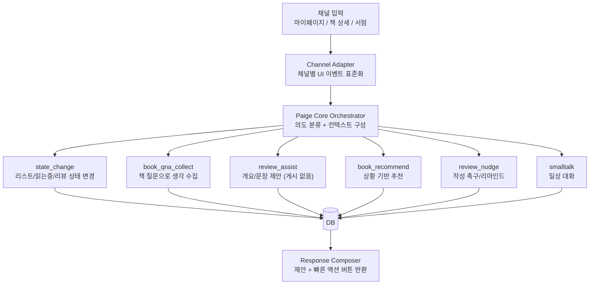
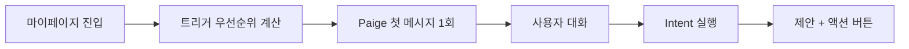
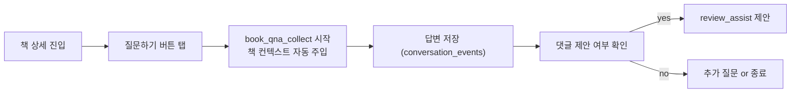
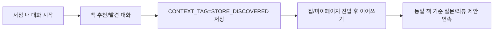

# Paige 에이전트 설계 문서 (MVP v2)

## 1. 제품 방향

- Paige는 "자동 게시 봇"이 아니라 "별점/댓글 작성을 돕는 에이전트"다.
- 리뷰는 `별점 + 댓글(선택)` 모델이며, 최종 등록은 반드시 사용자가 직접 수행한다.
- 대화 진입 채널은 3개이며, 코어 로직은 동일하게 재사용한다.
  1) 마이페이지 에이전트 챗봇 (우선 구현)
  2) 책 상세의 "질문하기" 버튼
  3) 서점 현장 채널 
- "찜한 책 입고" 트리거와 관련 UX는 v2에서 제거한다.

---

## 2. 멀티 채널 아키텍처 (마이페이지 코어 재사용)

핵심 규칙:
- 채널이 달라도 `Paige Core Orchestrator` 로직과 Intent는 동일하다.
- 차이는 `Channel Adapter`의 입력 타입/버튼 배치/톤만 가진다.

---

## 3. Intent 정의 (v2)

| Intent | 설명 | 예시 발화 | 주요 액션 |
|--------|------|-----------|-----------|
| `state_change` | 사용자 서재 상태를 변경 | "이 책 읽는중으로 옮겨줘" | book_user_state upsert |
| `book_qna_collect` | 책 질문 기반으로 생각/메모 수집 | "이 책 질문해줘" | conversation_events 저장 |
| `review_assist` | 댓글 작성 유도 + 대화 요약 포인트 제공 | "코멘트 뭘 써야 할지 모르겠어" | 대화 핵심 포인트/키워드 반환 |
| `review_nudge` | 부담 없는 작성 촉구 | "뭐부터 쓰면 좋지?" | 타이밍 제안/질문 재진입 |
| `book_recommend` | 맥락 기반 추천 | "오늘 가볍게 읽을 책 추천" | 추천 리스트 반환 |
| `smalltalk` | 일상 대화 + 자연스러운 책 전환 | "오늘 좀 지쳤어" | 공감 응답 + 추천/질문 CTA |

---

## 4. 상태 모델 (완독 중심 폐기)

`완독`을 강제하지 않고, 서재/리뷰 이벤트 중심으로 재정의한다.

### 4.1 기본 상태

- `LIST` : 볼 예정/사고 싶은 상태
- `READING` : 읽는중 (선택)
- `RATED_ONLY` : 별점 남김 + 댓글 미작성(또는 미등록)
- `REVIEW_POSTED` : 댓글 등록 완료

### 4.2 보조 태그

- `READING_PROOF`: `READ` / `PARTIAL` / `NOT_YET` (필수 아님)
- `CONTEXT_TAG`: `STORE_DISCOVERED`, `OFFLINE_PURCHASED`, `HOME_FOLLOWUP`

### 4.3 댓글 제안 플래그 규칙

- Paige는 댓글을 "대신 작성"하지 않고, 작성을 위한 포인트만 제안한다.
- Paige가 댓글(코멘트) 작성을 유도한 순간에도 `shelf_state`는 바뀌지 않는다.
- 대신 `book_user_states.comment_prompted_at`만 기록한다.
- 따라서 "별점 후 미댓글"과 "댓글 제안을 받았지만 아직 미작성"은 둘 다 `RATED_ONLY`로 표현된다.

### 4.4 리뷰 이벤트 규칙

- 별점은 완독 여부와 무관하게 언제든 등록 가능하다.
- 댓글은 선택사항이며, 아래 조건일 때 Paige가 작성을 권유한다.
  - 같은 책 채팅방 메시지(유저+AI)가 5개 이상 누적
  - 또는 해당 책에 별점이 등록됨(`RATED_ONLY`)
- `RATED_ONLY`는 취향 분석에 바로 반영한다.

---

## 5. 채널별 UX 플로우

### 5.1 마이페이지 (현재 메인)

트리거 후보 (입고 알림 제거):
- `CHAT_CONTEXT_READY`: 특정 책 대화 이벤트가 N개 이상
- `RATED_NO_COMMENT`: `RATED_ONLY`이고 댓글이 없는 상태가 N일 유지
- `STORE_FOLLOWUP`: 서점 맥락 태그가 최근 생성됨
- `RECOMMEND_WINDOW`: 시간대/기분 기반 추천 가능 시점

### 5.2 책 상세 옆 버튼 ("질문하기")

### 5.3 서점 채널 (곧 적용)

서점에서 시작한 맥락을 집에서도 이어서 별점/댓글로 연결하는 것이 핵심이다.

---

## 6. 리뷰 제안 원칙 (자동 게시 금지)

- 자동 생성은 "게시"가 아니라 "제안"까지만 수행한다.
- 제안 타입:
  - 책별 채팅 히스토리 요약 포인트(무엇을 느꼈는지)
  - 내가 남겼던 표현/키워드 리마인드
  - 코멘트 작성 가이드(문장 틀) 제공
- 모든 제안 응답에는 아래 CTA 중 1개 이상 포함:
  - `직접 코멘트 작성하기`
  - `다른 톤으로 다시 제안`
  - `질문 더 하며 생각 쌓기`

---

## 7. 책별 채팅방 / 히스토리 정책

- 메모 기능은 별도 탭으로 분리하지 않는다.
- 책별 채팅방 히스토리가 사실상 메모 역할을 수행한다.
- 마이페이지에서도 각 책 채팅방으로 재진입 가능해야 한다.
- 대화 저장 기준:
  - 책이 지정된 대화는 해당 `book_chat_room`에 저장
  - 책 미지정 일반 대화는 `general_session`에 저장 후, 책 확정 시 연결
- 리뷰(댓글) 제안 트리거:
  - 동일 책 채팅 이벤트 5개 이상
  - 또는 별점은 등록했지만 댓글 미등록 상태
---

## 8. 데이터 모델 (DB v2.1)

최신 DB 스키마는 별도 문서로 분리했습니다.

- 문서: `ai/paigee/docs/Paigee_database_schema.md`
- 기준: 앱 운영 DB(사용자/서재/리뷰/대화/추천) + AI 캐시/벡터 저장 테이블

핵심 반영 사항:
- `book_user_states` 상태 모델(`LIST`, `READING`, `RATED_ONLY`, `REVIEW_POSTED`) 유지
- 대화 저장이 `conversation_rooms` / `conversation_messages` 개념으로 명확화
- `book_api_cache`, `book_vectors` 등 AI 파이프라인 보조 테이블 추가
- 커뮤니티 확장용 `collections`, `collection_books`, `review_likes` 포함

---

## 9. 우선순위 트리거 (마이페이지 v1)

| 트리거 | 조건 | score | 발화 예시 |
|--------|------|-------|-----------|
| 책 대화 충분 | `book_room_events >= 5` | 100 | "지금까지 나눈 얘기 바탕으로 코멘트 한번 남겨볼까요?" |
| 별점 후 미댓글(제안 대기) | `RATED_ONLY` + `comment_prompted_at` 존재 | 80 | "별점 남긴 내용에 왜 그렇게 느꼈는지 한 줄만 더 남겨볼까요?" |
| 별점 후 미댓글(첫 제안 전) | `RATED_ONLY` + `comment_prompted_at` null | 60 | "이 책에서 기억에 남은 포인트를 코멘트로 남겨볼까요?" |
| 서점 맥락 후속 | 최근 `STORE_DISCOVERED` | 60 | "서점에서 봤던 그 책, 집에서 차분히 정리해볼까요?" |
| 추천 타이밍 | 저녁/주말 + 선호장르 일치 | 40 | "오늘 컨디션에 맞는 짧은 책 2권 가져왔어요." |
| 기본 인사 | 위 조건 없음 | 10 | "오늘은 어떤 책 이야기부터 해볼까요?" |

---

## 10. 툴 라우터 설계 (Intent -> Tool)

| Intent | primary tool | fallback | 비고 |
|--------|--------------|----------|------|
| `state_change` | `book_state_tool` | `clarify_tool` | 상태/태그 변경 |
| `book_qna_collect` | `book_chat_tool` | `clarify_tool` | 책별 채팅방 이벤트 저장 |
| `review_assist` | `comment_suggestion_tool` | `book_chat_summary_tool` | 채팅 히스토리 요약 기반 제안 |
| `review_nudge` | `nudge_tool` | `book_chat_summary_tool` | 댓글 작성 제안 메시지 |
| `book_recommend` | `recommendation_tool` | `popular_books_tool` | 상황형 추천 |
| `smalltalk` | `smalltalk_tool` | `handoff_to_recommendation` | 자연스럽게 책 대화 전환 |

라우팅 규칙:
- `book_id`가 있으면 무조건 책별 채팅방 컨텍스트 우선.
- `book_id`가 없으면 최근 활성 책 채팅방 후보를 1회 제안.
- tool 실패 시 즉시 fallback 후, 사용자에게 선택지 버튼 제공.

---

## 11. 미결정 사항

| 항목 | 옵션 A | 옵션 B | 비고 |
|------|--------|--------|------|
| 댓글 제안 임계치 | events 6개 | events 10개 | 실사용 전환율로 조정 |
| nudge 주기 | 3일 | 7일 | 피로도 측정 필요 |
| 서점 채널 인증 | 임시 게스트 세션 | 회원 즉시 매핑 | 운영 방식 결정 필요 |
| 추천 알고리즘 | 룰 기반 우선 | 벡터 혼합 | 초기 품질 vs 구현속도 |