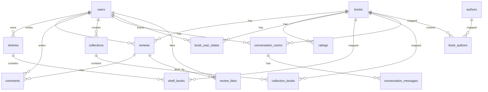

# Paige Database Schema (v2.1)

이 문서는 최신 공유안 기준 DB 스키마를 정리한 문서입니다.

- 대상: BookJukBookJuk 서비스 운영 DB
- 용도: 기능 설계/백엔드 구현/마이그레이션 기준 정렬
- 기준 시점: 2026-03-27

## 1) 개요

현재 스키마는 다음 5개 도메인으로 구성됩니다.

1. 사용자/인증: `users`
2. 도서/저자: `books`, `authors`, `book_authors`
3. 서재/리뷰/소셜: `shelves`, `shelf_books`, `ratings`, `reviews`, `comments`, `review_likes`, `collections`, `collection_books`, `book_user_states`
4. 대화/에이전트: `conversation_rooms`, `conversation_messages`
5. AI 데이터: `book_api_cache`, `book_vectors`

## 2) 테이블 정의 (정리본)

아래는 전달된 DDL을 기준으로 이름을 정리해 표현한 문서용 스키마입니다.

### 2.1 사용자

#### `users`
- `id` (`Key`) PK, `VARCHAR(255)`
- `username` `VARCHAR(50)` NOT NULL
- `password` `VARCHAR(255)` NOT NULL
- `nickname` `VARCHAR(50)` NOT NULL
- `profile_image_url` `VARCHAR(500)` NULL
- `bio` `TEXT` NULL
- `preferred_genres` `VARCHAR(500)` NULL
- `created_at` `DATETIME` NOT NULL DEFAULT `CURRENT_TIMESTAMP`

### 2.2 도서/저자

#### `books`
- `id` (`Key`) PK, `VARCHAR(255)`
- `isbn` `VARCHAR(20)` NULL
- `title` `VARCHAR(300)` NOT NULL
- `publication_year` `INT` NULL
- `pages` `INT` NULL
- `age_rating` `VARCHAR(20)` NULL
- `category` `VARCHAR(100)` NULL
- `description` `TEXT` NULL
- `cover_image_url` `VARCHAR(500)` NULL
- `created_at` `DATETIME` NOT NULL DEFAULT `CURRENT_TIMESTAMP`

#### `authors`
- `id` (`Key`) PK, `VARCHAR(255)`
- `name` `VARCHAR(100)` NOT NULL
- `created_at` `DATETIME` NOT NULL DEFAULT `CURRENT_TIMESTAMP`

#### `book_authors`
- `author_id` (`Key2`) NOT NULL
- `book_id` (`Key`) NOT NULL
- `role` `VARCHAR(50)` NOT NULL DEFAULT `'저자'`

### 2.3 서재/리뷰/소셜

#### `shelves`
- `id` (`Key`) PK, `VARCHAR(255)`
- `user_id` `BIGINT` NOT NULL
- `shelf_type` `ENUM('평가한', '읽은', '읽는중', '쇼핑리스트')` NOT NULL
- `created_at` `DATETIME` NOT NULL DEFAULT `CURRENT_TIMESTAMP`

#### `shelf_books`
- `book_id` (`Key`) NOT NULL
- `shelf_id` (`Key2`) NOT NULL
- `added_at` `DATETIME` NOT NULL DEFAULT `CURRENT_TIMESTAMP`

#### `book_user_states`
- `user_id` (`Key2`) NOT NULL
- `book_id` (`Key`) NOT NULL
- `shelf_state` `ENUM('LIST', 'READING', 'RATED_ONLY', 'REVIEW_POSTED')` NOT NULL
- `reading_proof_url` `VARCHAR(500)` NULL
- `comment_prompted_at` `DATETIME` NULL
- `context_tags` `JSON` NULL
- `updated_at` `DATETIME` NOT NULL DEFAULT `CURRENT_TIMESTAMP`

#### `ratings`
- `user_id` (`Key`) NOT NULL
- `book_id` (`Key2`) NOT NULL
- `score` `DECIMAL(2,1)` NOT NULL
- `registered_at` `DATETIME` NOT NULL DEFAULT `CURRENT_TIMESTAMP`

#### `reviews`
- `id` (`Key`) PK, `VARCHAR(255)`
- `user_id` `BIGINT` NOT NULL
- `book_id` `BIGINT` NOT NULL
- `content` `TEXT` NOT NULL
- `created_at` `DATETIME` NOT NULL DEFAULT `CURRENT_TIMESTAMP`

#### `comments`
- `id` (`Key`) PK, `VARCHAR(255)`
- `review_id` `BIGINT` NOT NULL
- `user_id` `BIGINT` NOT NULL
- `content` `TEXT` NOT NULL
- `created_at` `DATETIME` NOT NULL DEFAULT `CURRENT_TIMESTAMP`

#### `review_likes`
- `user_id` (`Key`) NOT NULL
- `review_id` (`Key2`) NOT NULL
- `created_at` `DATETIME` NOT NULL DEFAULT `CURRENT_TIMESTAMP`

#### `collections`
- `id` (`Key`) PK, `VARCHAR(255)`
- `user_id` `BIGINT` NOT NULL
- `title` `VARCHAR(200)` NOT NULL
- `description` `TEXT` NULL
- `is_public` `BOOLEAN` NOT NULL DEFAULT `TRUE`
- `created_at` `DATETIME` NOT NULL DEFAULT `CURRENT_TIMESTAMP`

#### `collection_books`
- `book_id` (`Key`) NOT NULL
- `collection_id` (`Key2`) NOT NULL
- `order_index` `INT` NOT NULL DEFAULT `0`
- `added_at` `DATETIME` NOT NULL DEFAULT `CURRENT_TIMESTAMP`

### 2.4 대화/에이전트

> 원본 DDL의 `Untitled`, `Untitled2`는 의미 있는 이름으로 문서화했습니다.

#### `conversation_rooms` (원본: `Untitled`)
- `id` (`Key`) PK, `VARCHAR(255)` - 대화방 ID
- `user_id` (`Key2`) NOT NULL - 사용자 ID
- `book_id` (`Key3`) NOT NULL - 책 상세 채널일 때 대상 도서 ID
- `created_at` (`Field4`) NULL
- `channel_type` (`Field`) NULL - `agent | book_detail`

#### `conversation_messages` (원본: `Untitled2`)
- `id` (`Key`) PK, `VARCHAR(255)` - 메시지 ID
- `room_id` (`Key2`) NOT NULL - 대화방 ID
- `role` (`Field`) NULL - `user | ai`
- `content` (`Field2`) NULL
- `intent` (`Field3`) NULL - agent 채널에서만 사용
- `created_at` (`Field4`) NULL

### 2.5 AI 데이터

#### `book_api_cache`
- `isbn` `VARCHAR(20)` NULL
- `description` `TEXT` NULL
- `author_bio` `TEXT` NULL
- `editorial_review` `TEXT` NULL
- `keywords` `JSON` NULL
- `subject_names` `JSON` NULL
- `wiki_book_summary` `TEXT` NULL
- `wiki_author_summary` `TEXT` NULL
- `wiki_extra_sections` `JSON` NULL
- `cached_at` `DATETIME` NOT NULL DEFAULT `CURRENT_TIMESTAMP`
- `expires_at` `DATETIME` NOT NULL

#### `book_vectors`
- `isbn` `VARCHAR(20)` NULL
- `title` `VARCHAR(300)` NOT NULL
- `authors` `VARCHAR(500)` NULL
- `vector` `JSON` NOT NULL
- `kdc_class` `VARCHAR(50)` NULL
- `is_cold_start` `BOOLEAN` NOT NULL DEFAULT `FALSE`
- `created_at` `DATETIME` NOT NULL DEFAULT `CURRENT_TIMESTAMP`
- `updated_at` `DATETIME` NOT NULL DEFAULT `CURRENT_TIMESTAMP`

### 2.6 기타

#### `stores`
- `id` (`Key`) PK, `VARCHAR(255)`
- `name` `VARCHAR(200)` NOT NULL
- `address` `VARCHAR(500)` NULL
- `latitude` `DECIMAL(10,7)` NULL
- `longitude` `DECIMAL(10,7)` NULL
- `phone` `VARCHAR(20)` NULL
- `business_hours` `VARCHAR(200)` NULL
- `created_at` `DATETIME` NOT NULL DEFAULT `CURRENT_TIMESTAMP`

## 3) 관계 요약

- `users` 1:N `shelves`, `reviews`, `comments`, `collections`, `conversation_rooms`
- `books` N:M `authors` via `book_authors`
- `shelves` N:M `books` via `shelf_books`
- `collections` N:M `books` via `collection_books`
- `users` N:M `books` via `ratings`, `book_user_states`
- `reviews` 1:N `comments`
- `users` N:M `reviews` via `review_likes`
- `conversation_rooms` 1:N `conversation_messages`

## 3.1 ERD (연결선 다이어그램)

> 참고: 현재 물리 DDL에는 일부 FK 제약이 명시되지 않았고, 위 다이어그램은 서비스 도메인 관계를 기준으로 표현했습니다.

## 4) 네이밍 정리 제안

현재 실제 DDL에는 `Key`, `Key2`, `Field*`, `Untitled*` 같은 임시 이름이 포함되어 있습니다.
운영/개발 생산성을 위해 아래처럼 정식 마이그레이션을 권장합니다.

- 컬럼: `Key` -> `id`, `Key2` -> `<entity>_id`, `Field` -> 의미 있는 이름
- 테이블: `Untitled` -> `conversation_rooms`, `Untitled2` -> `conversation_messages`
- 일관성: FK 타입 통일 (`VARCHAR` vs `BIGINT` 혼용 정리)

## 5) Paige 의도/상태와 직접 연결되는 핵심 테이블

- 상태 전이: `book_user_states`
- 리뷰 생성: `reviews`, `comments`
- 별점: `ratings`
- 대화 이벤트: `conversation_rooms`, `conversation_messages`
- AI 재사용 데이터: `book_api_cache`, `book_vectors`

