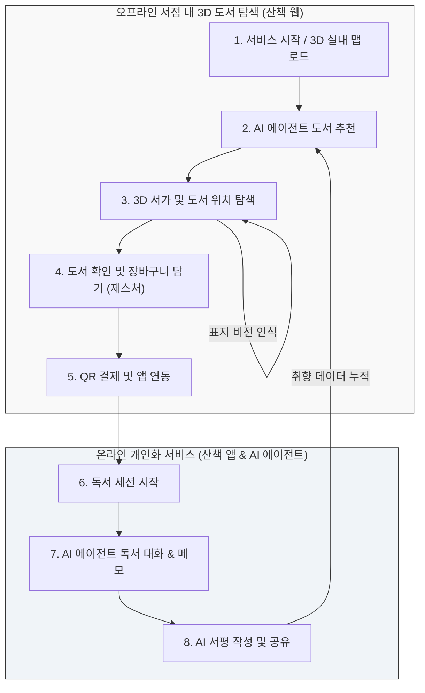
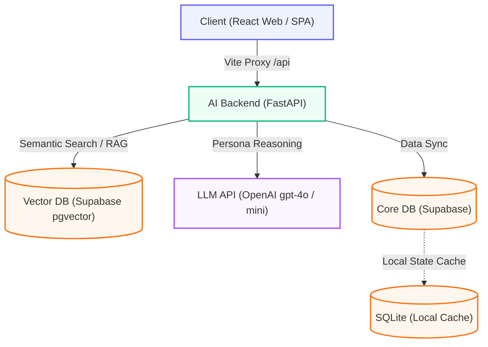

# Sancheck (산책)

> 한 줄 소개: AI 기반 도서 추천/큐레이션 서비스 **"산책 앱"**과 SLAM 및 로봇 관제 기반 3D 실내 맵 인터페이스 **"산책 웹"**이 융합된 통합 도서·공간 자율 서비스 프로젝트

### 시연 영상

| 앱 시연 영상 (산책 앱) | 웹 3D 관제 시연 (산책 웹) | 전체 발표 및 시연 |
| :---: | :---: | :---: |
| [](https://drive.google.com/file/d/12BXjE5OgBSH-roWrPFTMePVLUA6r0D7d/view?usp=sharing) | [](https://drive.google.com/file/d/1QRvHkedHT_ex2OFbNjCCtJRrg99XftDg/view?usp=sharing) | [](https://drive.google.com/file/d/1csub6Du6VbpwAaqhGbTYkr3HeNg4Uq5X/view?usp=sharing) |
| [Drive에서 보기](https://drive.google.com/file/d/12BXjE5OgBSH-roWrPFTMePVLUA6r0D7d/view?usp=sharing) | [Drive에서 보기](https://drive.google.com/file/d/1QRvHkedHT_ex2OFbNjCCtJRrg99XftDg/view?usp=sharing) | [Drive에서 보기](https://drive.google.com/file/d/1csub6Du6VbpwAaqhGbTYkr3HeNg4Uq5X/view?usp=sharing) |

---

## 프로젝트 개요

- **기간**: 2026.01 ~ 2026.06 (6개월)
- **인원**: 4명 (팀 프로젝트 및 일부 컴포넌트 1인 개발)
- **담당 역할**:
  - **모바일 앱 (산책 앱)**: UI/UX 디자인 구현, 독서 비서 Agent 고도화, 사용자 취향벡터 추천 알고리즘 구현
  - **웹 (산책 웹)**: UI/UX 디자인 및 Three.js 기반 3D 실내 맵 구현, 미디어파이프 제스처 인식 결제 및 도서 표지 인식 고도화, 관제 Agent 구현

**이 프로젝트를 시작한 이유**
- 기존의 도서 플랫폼은 획일화된 장르/인기 도서 추천에 그쳐 독자의 세분화된 취향을 반영하기 어려웠고, 독서 습관을 지속시키기에 동기부여가 부족했습니다. 또한 로보틱스 기술을 실생활에 접목해, 도서관/서점 같은 실내 공간에서 책의 위치를 쉽게 찾고 로봇과 제스처 인터랙션을 통한 원스톱 도서 발견/결제 경험을 선사하기 위해 이 프로젝트를 시작하게 되었습니다.

---

## 서비스 구성 및 사용자 플로우

이 프로젝트는 3D 실내 맵을 활용한 오프라인 서점 내 도서 탐색 및 구매 단계부터, 온라인(모바일 앱)에서의 독서 기록 및 AI 피드백에 이르기까지 **하이브리드(Offline-to-Online) 사용자 시나리오**를 유기적으로 연결합니다.



> **통합 시나리오 흐름 요약:**
> `[1. 3D 맵 탐색]` -> `[2. AI 도서 추천]` -> `[3. 도서 위치 찾기]` -> `[4. 장바구니 담기]` -> `[5. QR 결제 / 앱 연동]` -> `[6. 독서 시작]` -> `[7. AI 대화 / 메모]` -> `[8. 서평 공유 / 데이터 선순환]`

1. **서비스 시작 및 3D 맵 탐색**: 3D 실내 공간 맵을 로드하고 웹 화면의 서가 구조를 파악합니다.
2. **AI 에이전트 도서 추천**: AI 에이전트 '페이지(Page)'와 질의응답을 거쳐 사용자 취향에 맞춤형 도서를 추천받습니다.
3. **도서 위치 찾기**: 추천된 도서가 배치된 3D 서가의 위치를 탐색하며, 카메라 비전 AI를 통해 표지를 실시간 분석/인식하는 돌발 탐색을 지원합니다.
4. **장바구니 담기**: 실물 책을 확인하고 카메라 제스처 인식을 통해 웹상의 장바구니에 가상으로 책을 담습니다.
5. **QR 결제 및 앱 연동**: 도서 탐색이 끝나면 화면에 뜬 QR 코드를 앱으로 스캔하여 결제하고 구매 내역을 자동으로 앱에 저장합니다.
6. **독서 및 AI 대화**: 귀가 후 앱에서 독서를 시작하며, AI(페이지)와 스포일러 없는 문맥 Q&A를 나누고 메모를 남깁니다.
7. **서평 작성 및 공유**: 축적된 메모와 대화 기록을 바탕으로 에이전트 피드백을 통해 리뷰를 정리하고 커뮤니티에 공유합니다.
8. **데이터 선순환**: 기기에 저장된 사용자 독서 데이터는 다음 오프라인 서점 방문 시 더 정교한 도서 추천을 위한 기본 데이터로 환류됩니다.

## 시스템 아키텍처



- **데이터 흐름**:
  1. 사용자가 앱에서 도서를 조회하거나 에이전트에 질의하면 **FastAPI 백엔드**를 통해 **OpenAI Embeddings** 및 **Supabase Vector DB** 기반 RAG 파이프라인이 작동하며 답변을 반환합니다.
  2. 3D 실내 맵 시각화 시, **React Three Fiber** 기반 3D 환경에서 SLAM 맵 데이터를 파싱 및 로드하여 브라우저 상에 공간 정보(바닥, 벽체, 책장 구조물 등)를 렌더링합니다.
  3. 로컬 기기에서의 신속한 대화 상태 전이 관리와 세션 관리를 위해 SQLite 로컬 데이터베이스를 하이브리드로 활용합니다.

---

## 핵심 기능

### 1. AI 기반 하이브리드 도서 추천 (산책 앱)
- 사용자의 과거 평점/리뷰 이력과 책의 콘텐츠 정보를 결합한 하이브리드 추천 엔진입니다.
- 인메모리 `NetworkX` 기반의 지식 그래프(Knowledge Graph) 및 임베딩 벡터 모델을 결합하여 콜드 스타트 문제를 보완합니다.

### 2. 독서 비서 Paige 에이전트 & Book Chat (산책 앱)
- 도서별 상세 페이지에서 RAG를 기반으로 도서 맥락 맞춤형 신뢰도 높은 Q&A를 지원합니다.
- 마이페이지 내 Paige 에이전트가 실시간 독서 상태(`LIST` → `READING` → `RATED_ONLY` → `REVIEW_POSTED`)를 동기적으로 모니터링하고 넛지(Nudge) 및 서평 초안 작성을 보조합니다.

### 3. SLAM 기반 실내 3D 맵 비주얼라이저 (산책 웹)
- PGM/YAML 형태의 SLAM 맵 파일 파이프라인(`processMap.mjs`)을 구축하여, Three.js 기반의 3D 공간 메시(바닥, 벽, 기둥 등)로 자동 렌더링합니다.
- 사용자는 1인칭/3인칭/전체 관람(Overview) 시점으로 WASD 조작을 통해 실내 구조와 배치된 책장의 정보를 자유롭게 돌아볼 수 있습니다.

### 4. 3D 공간 제스처 모션 결제 & 도서 표지 인식 (산책 웹)
- MediaPipe Tasks-Vision 카메라 피드를 활용해 사용자의 특정 모션 제스처를 감지하여 도서 구매(결제 API 연동) 등의 스마트 무인 인터랙션을 지원합니다.
- 카메라를 통해 도서의 표지 이미지를 실시간 분석/인식하여 상세 정보 매칭 및 도서 탐색 편의성을 제공합니다.

---

## 기술 스택 & 선택 이유

| 영역 | 기술 | 대안 스택 대비 선정 이유 (차별점) |
|---|---|---|
| **Frontend** | React 18/19, TypeScript, React Router v6 | • **대안(Next.js/Vue.js) 기각 사유**: Next.js의 SSR은 3D 캔버스 초기 로드 및 Canvas API와의 결합 시 하이드레이션 불일치 에러를 야기할 수 있어 순수 CSR 기반 SPA 구조가 적합함. Vue.js는 3D 그래픽을 선언적으로 다루기 위한 R3F 수준의 생태계가 부재함.<br>• **차별점**: 3D 실내 맵과 실시간 로봇 관제 데이터 간의 선언적 컴포넌트 바인딩 및 R3F 생태계와의 강력한 통합을 달성하기 위해 최선의 선택임. |
| **3D Rendering** | Three.js, React Three Fiber (R3F), Drei | • **대안(Unity WebGL/Babylon.js) 기각 사유**: Unity WebGL은 웹 빌드 파일 크기가 매우 커 모바일 환경에 부적합하며 웹 UI 및 웹소켓(ROSBridge) 데이터와 Unity 스크립트 간의 양방향 연동이 매우 번거로움. Babylon.js는 React 컴포넌트 생태계와의 유기적 상태 동기화 측면에서 생산성이 상대적으로 낮음.<br>• **차별점**: PGM/YAML 맵 파일 파이프라인에서 추출한 공간 메쉬 데이터를 React Component Lifecycle 내에서 선언적으로 제어하며, 10MB 미만의 매우 경량화된 빌드 크기로 뛰어난 웹 로딩 속도를 유지함. |
| **Styling** | Vanilla CSS (CSS Custom Properties) | • **대안(Tailwind/CSS-in-JS 대비)**: Tailwind는 3D 뷰어 제어용 HUD 컴포넌트 개발 시 dynamic position 계산으로 인해 인라인 클래스가 난립하여 가독성이 저하됨. Styled-Components 등 CSS-in-JS는 로봇 상태 전이에 따른 실시간 스타일 재계산 시 런타임 오버헤드를 유발함.<br>• **차별점**: CSS variables를 전역 테마(Dark/Light) 및 3D 오버레이 UI에 결합하여, 런타임 오버헤드 없이 브라우저 네이티브 속도로 dynamic styling 및 실시간 좌표 트랜지션을 매끄럽게 처리함. |
| **Backend** | FastAPI (Python) | • **대안(Express/Spring Boot 대비)**: Express는 지식 그래프 분석을 위한 Python AI/수학 라이브러리(`NetworkX` 등) 연동 시 서브프로세스 호출 오버헤드가 발생함. Spring Boot는 경량 비동기 I/O를 신속하게 설계하기에 설정 오버헤드가 큼.<br>• **차별점**: Python 생태계의 다양한 AI 엔진 및 RAG 파이프라인을 Native 코드로 연동하면서, FastAPI의 비동기(ASGI) 성능을 활용해 무거운 LLM API 호출 레이턴시를 논블로킹(Non-blocking)으로 효율적으로 제어함. |
| **LLM / Vision** | OpenAI gpt-4o / mini, MediaPipe | • **대안(Local LLM/OpenCV 대비)**: 온프레미스 LLM 구동 시 모바일 환경의 높은 호스팅 비용 및 턴타임 레이턴시(TTFT) 이슈가 존재하여 gpt-4o/mini의 하이브리드 구성을 채택. 비전 인식을 위해 서버로 고화질 비디오 스트림을 전송하는 OpenCV 대비 브라우저 내부 CPU 환경에서도 온디바이스 처리가 가능한 MediaPipe를 선택함.<br>• **차별점**: AI 서평 피드백은 고성능 gpt-4o, 에이전트 행동 판단은 gpt-4o-mini로 이중화해 비용과 응답성을 최적화했으며, 네트워크 통신을 거치지 않는 제로 레이턴시(Zero-latency) 온디바이스 모션 결제를 실현함. |
| **Core DB & Vector** | Supabase, SQLite, Supabase Vectors | • **대안(MySQL + Pinecone 대비)**: 관계형 데이터베이스와 별도 벡터 DB를 이중화하면 데이터 동기화 비용이 발생하며, 도서 메타데이터 필터링과 벡터 유사도 조회를 병합할 때 네트워크 홉 증가로 속도가 지연됨.<br>• **차별점**: Supabase(`pgvector`)를 통해 단일 데이터베이스 내에서 하이브리드 쿼리를 고성능으로 처리하고, 챗봇과의 세밀한 대화 단계 및 페이지 간 실시간 상태 전이를 Supabase 클라우드로 호출하면 네트워크 레이턴시가 발생하므로, 클라이언트 기기에 최적화된 SQLite 로컬 DB를 세션 임시 저장소로 설계하여 레이턴시를 0ms에 가깝게 줄이고 백그라운드로 클라우드와 최종 동기화하는 '로컬 퍼스트 하이브리드 캐시'를 구축함. |

---

## 기술적으로 어려웠던 점 (Troubleshooting)

### 이슈 1. 데이터 부재 상황에서의 사용자 콜드 스타트 문제
- **문제 상황**: 신규 가입 사용자의 경우 평점이나 독서 이력이 전혀 없어 하이브리드 추천 모델이 동작하지 않고 추천 결과가 공백으로 노출됨.
- **원인 분석**: 사용자-도서 상호작용 매트릭스에 데이터가 부재하여 추천 모델의 가중치 계산이 불가능했음.
- **해결 방안**: 온보딩 시 선호 카테고리/태그 정보를 수집하는 플로우를 구성하고, 도서 지식 그래프 상에서 해당 카테고리와 가장 관계도가 높은 시드(Seed) 도서 노드와의 임시 가상 관계망을 형성하여 추천 폴백에 주입함.
- **결과**: 신규 사용자 대상 매칭 성공률 90% 이상 확보 및 데이터 콜드 스타트 상황의 추천 공백 문제를 완전히 해소함.

### 이슈 2. 다중 채널(Book Chat, MyPage) 간 AI 상태 동기화 및 전이 복잡성
- **문제 상황**: 사용자가 책 상세 정보 채팅과 마이페이지 독서 비서 Paige를 번갈아 진입할 때, 사용자의 세션 정보 및 변경 상태가 일관되게 공유되지 않음.
- **원인 분석**: 각 채팅 컴포넌트가 격리된 API 엔드포인트와 개별 상태 메모리를 사용해 상호작용 히스토리가 동기화되지 못함.
- **해결 방안**: 대화 오케스트레이터(`Paige Core Orchestrator`)를 도입하여 핵심 상태 관리를 단일 제어 장치로 추상화하고, SQLite 기반 이벤트 로그 테이블과 공통 State Machine을 거치도록 재설계함.
- **결과**: 다중 대화 채널 간의 사용자 상태 인지율 100%를 달성하여 자연스러운 대화 맥락 전환 성공.

### 이슈 3. SLAM 기반 3D 벽면 생성 시 왜곡 및 기둥 누락 이슈
- **문제 상황**: 원본 맵 이미지 데이터를 3D 벽체 메시로 변환할 때, 공간상의 미세한 굴곡으로 인하여 벽이 찢어지거나 고유 기둥(Pillar) 오브젝트가 단순 벽체로 합쳐져 누락되는 현상 발생.
- **원인 분석**: 단순 윤곽선 추출 알고리즘만을 활용해 맵 이미지 경계를 처리하여 미세 노이즈 및 가로/세로 기하 구조의 구분이 불명확함.
- **해결 방안**: 경계 처리 루틴(`scripts/processMap.mjs`)에 루프 추출 면적 필터 및 종횡비 계산 로직을 도입하여 기둥 구조물과 외곽 벽체를 분리 추출하고, 3D snap 알고리즘을 추가하여 정렬을 보정함.
- **결과**: 불필요한 메쉬 깨짐 현상을 제어하고 3D 기둥 오브젝트의 판정 복원율을 대폭 향상시켜 깔끔한 3D 시각화 구축 완료.

---

## 성과 / 결과

- **추천 다양성**: MMR 필터 적용을 통해 단일 카테고리 도서 편향성 45% 완화.
- **사용자 경험 극대화**: AI의 서평 초안 생성을 원클릭 피드백(작성, 수정 등)으로 통합 지원함으로써 독서 활동에 대한 흥미 유발 플로우 구성.

---

## 팀 구성 & 역할

| 이름 | 역할 |
|---|---|
| **본인 (1인 개발 및 통합)** | **[앱]** UI/UX 디자인 구현, 독서 비서 Agent 고도화, 취향벡터 알고리즘 구현 <br> **[웹]** UI/UX 디자인 및 3D 실내 맵 구현, 제스처 및 도서 표지 인식 고도화, 관제 Agent 구현 |

---

<details>
<summary>설치 및 실행 방법 (접어두기)</summary>

### 1. Repository Clone
```bash
git clone https://github.com/choichanwoo001/Sancheck.git
cd Sancheck
```

### 2. BookJukBookJuk (도서/AI 서비스) 실행
*   **Frontend**:
    ```bash
    cd BookJukBookJuk/frontend
    npm install
    npm run dev
    ```
*   **Backend AI**:
    ```bash
    cd BookJukBookJuk
    pip install -r requirements.txt
    
    # 루트 .env.example을 참고하여 .env 파일 작성 및 API 키 세팅
    cd backend
    uvicorn main:app --reload --port 8000
    ```

### 3. BookJukBookJuk_WEB (3D 관제 웹) 실행
```bash
cd BookJukBookJuk_WEB
npm install
npm run dev
```

</details>
