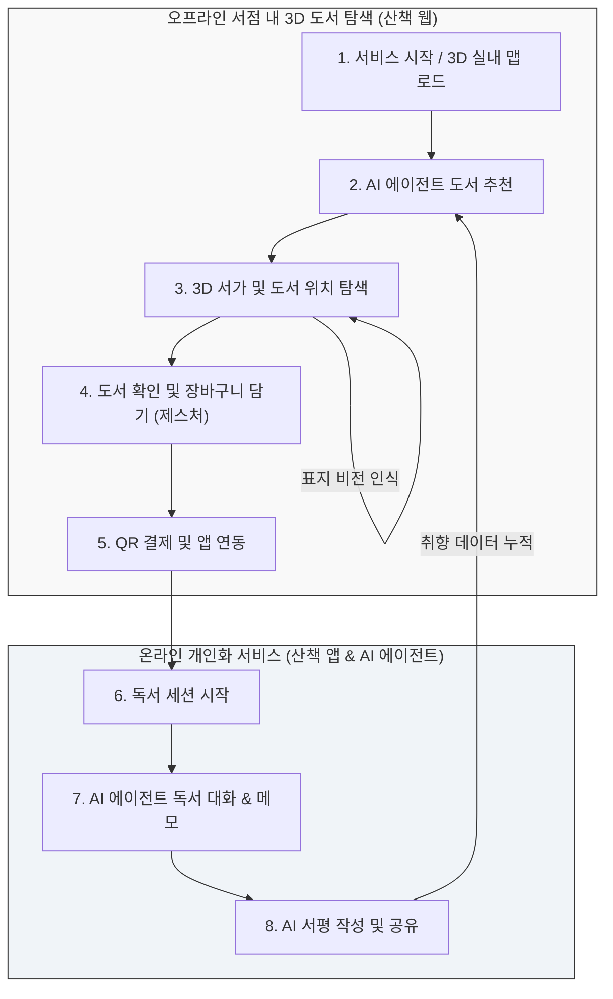
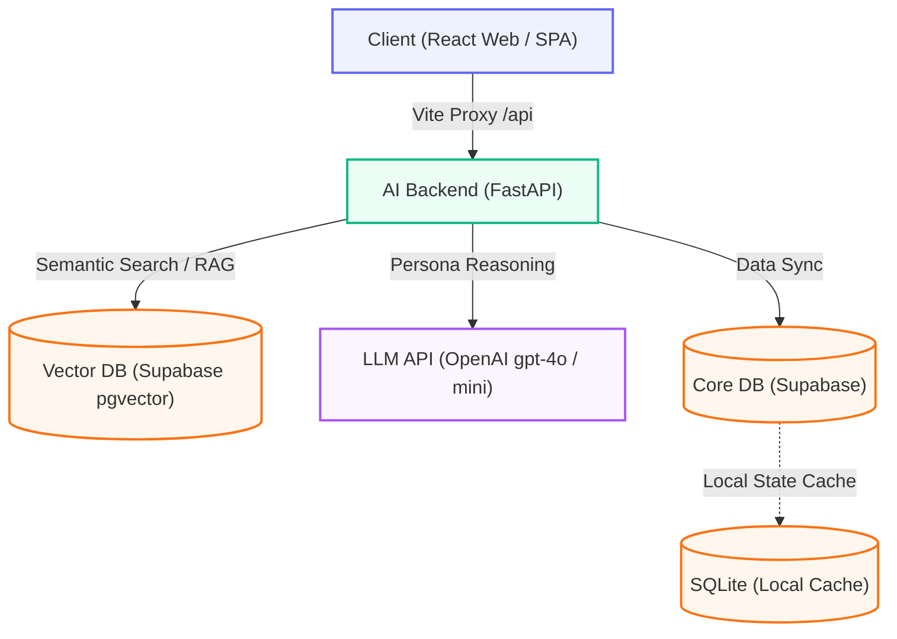

# Sancheck (산책)

> 한 줄 소개: AI 기반 도서 추천/큐레이션 서비스 **"산책 앱"**과 SLAM 및 로봇 관제 기반 3D 실내 맵 인터페이스 **"산책 웹"**이 융합된 통합 도서·공간 자율 서비스 프로젝트

### 시연 영상

| 앱 시연 영상 (산책 앱) | 웹 3D 관제 시연 (산책 웹) | 전체 발표 및 시연 |
| :---: | :---: | :---: |
|  |  |  |
| [Drive에서 보기](https://drive.google.com/file/d/12BXjE5OgBSH-roWrPFTMePVLUA6r0D7d/view?usp=sharing) | [Drive에서 보기](https://drive.google.com/file/d/1QRvHkedHT_ex2OFbNjCCtJRrg99XftDg/view?usp=sharing) | [Drive에서 보기](https://drive.google.com/file/d/1csub6Du6VbpwAaqhGbTYkr3HeNg4Uq5X/view?usp=sharing) |

---

## 프로젝트 개요

- **기간**: 2026.01 ~ 2026.06 (6개월)
- **인원**: 4명 (팀 프로젝트 및 일부 컴포넌트 1인 개발)
- **담당 역할**:
  - **모바일 앱 (산책 앱)**: UI/UX 디자인 구현, 독서 비서 Agent 고도화, 사용자 취향벡터 추천 알고리즘 구현
  - **웹 (산책 웹)**: UI/UX 디자인 및 Three.js 기반 3D 실내 맵 구현, 미디어파이프 제스처 인식 결제 및 도서 표지 인식 고도화, 관제 Agent 구현

**이 프로젝트를 시작한 이유**
- 기존의 도서 플랫폼은 획일화된 장르/인기 도서 추천에 그쳐 독자의 세분화된 취향을 반영하기 어려웠고, 독서 습관을 지속시키기에 동기부여가 부족했습니다. 또한 로보틱스 기술을 실생활에 접목해, 도서관/서점 같은 실내 공간에서 책의 위치를 쉽게 찾고 로봇과 제스처 인터랙션을 통한 원스톱 도서 발견/결제 경험을 선사하기 위해 이 프로젝트를 시작하게 되었습니다.

---

## 서비스 구성 및 사용자 플로우

이 프로젝트는 3D 실내 맵을 활용한 오프라인 서점 내 도서 탐색 및 구매 단계부터, 온라인(모바일 앱)에서의 독서 기록 및 AI 피드백에 이르기까지 **하이브리드(Offline-to-Online) 사용자 시나리오**를 유기적으로 연결합니다.

1. **서비스 시작 및 3D 맵 탐색**: 3D 실내 공간 맵을 로드하고 웹 화면의 서가 구조를 파악합니다.
2. **AI 에이전트 도서 추천**: AI 에이전트 '페이지(Page)'와 질의응답을 거쳐 사용자 취향에 맞춤형 도서를 추천받습니다.
3. **도서 위치 찾기**: 추천된 도서가 배치된 3D 서가의 위치를 탐색하며, 카메라 비전 AI를 통해 표지를 실시간 분석/인식하는 돌발 탐색을 지원합니다.
4. **장바구니 담기**: 실물 책을 확인하고 카메라 제스처 인식을 통해 웹상의 장바구니에 가상으로 책을 담습니다.
5. **QR 결제 및 앱 연동**: 도서 탐색이 끝나면 화면에 뜬 QR 코드를 앱으로 스캔하여 결제하고 구매 내역을 자동으로 앱에 저장합니다.
6. **독서 및 AI 대화**: 귀가 후 앱에서 독서를 시작하며, AI(페이지)와 스포일러 없는 문맥 Q&A를 나누고 메모를 남깁니다.
7. **서평 작성 및 공유**: 축적된 메모와 대화 기록을 바탕으로 에이전트 피드백을 통해 리뷰를 정리하고 커뮤니티에 공유합니다.
8. **데이터 선순환**: 기기에 저장된 사용자 독서 데이터는 다음 오프라인 서점 방문 시 더 정교한 도서 추천을 위한 기본 데이터로 환류됩니다.

## 시스템 아키텍처

## 핵심 기능

### 1. AI 기반 하이브리드 도서 추천 (산책 앱)
- 사용자의 과거 평점/리뷰 이력과 책의 콘텐츠 정보를 결합한 하이브리드 추천 엔진입니다.
- 인메모리 `NetworkX` 기반의 지식 그래프(Knowledge Graph) 및 임베딩 벡터 모델을 결합하여 콜드 스타트 문제를 보완합니다.

### 2. 독서 비서 Paige 에이전트 & Book Chat (산책 앱)
- 도서별 상세 페이지에서 RAG를 기반으로 도서 맥락 맞춤형 신뢰도 높은 Q&A를 지원합니다.
- 마이페이지 내 Paige 에이전트가 실시간 독서 상태(`LIST` → `READING` → `RATED_ONLY` → `REVIEW_POSTED`)를 동기적으로 모니터링하고 넛지(Nudge) 및 서평 초안 작성을 보조합니다.

### 3. SLAM 기반 실내 3D 맵 비주얼라이저 (산책 웹)
- PGM/YAML 형태의 SLAM 맵 파일 파이프라인(`processMap.mjs`)을 구축하여, Three.js 기반의 3D 공간 메시(바닥, 벽, 기둥 등)로 자동 렌더링합니다.
- 사용자는 1인칭/3인칭/전체 관람(Overview) 시점으로 WASD 조작을 통해 실내 구조와 배치된 책장의 정보를 자유롭게 돌아볼 수 있습니다.

### 4. 3D 공간 제스처 모션 결제 & 도서 표지 인식 (산책 웹)
- MediaPipe Tasks-Vision 카메라 피드를 활용해 사용자의 특정 모션 제스처를 감지하여 도서 구매(결제 API 연동) 등의 스마트 무인 인터랙션을 지원합니다.
- 카메라를 통해 도서의 표지 이미지를 실시간 분석/인식하여 상세 정보 매칭 및 도서 탐색 편의성을 제공합니다.

---

## 기술 스택 & 선택 이유

| 영역 | 기술 | 선택 이유 |
|---|---|---|
| **Frontend** | React 18/19, TypeScript, React Router v6 | 3D 캔버스 환경에서 SSR 하이드레이션 충돌을 피하기 위해 순수 CSR SPA 구조 채택. R3F 생태계와의 통합이 핵심 요건이었음. |
| **3D Rendering** | Three.js, React Three Fiber (R3F), Drei | **Unity WebGL**은 빌드 크기가 커 웹 환경에 부적합하고 ROSBridge 연동이 복잡함. **Babylon.js**는 React 상태 동기화 생산성이 낮음. → R3F로 SLAM 맵 메쉬를 React 컴포넌트 라이프사이클 내에서 선언적으로 제어하고, 10MB 미만 경량 빌드로 빠른 로딩을 달성함. |
| **Styling** | Vanilla CSS (CSS Custom Properties) | 3D HUD 컴포넌트의 동적 position 계산 시 Tailwind 인라인 클래스 난립 문제를 피하고, CSS-in-JS 런타임 오버헤드 없이 브라우저 네이티브 속도로 실시간 좌표 트랜지션을 처리하기 위해 선택. |
| **Backend** | FastAPI (Python) | **Express**는 Python AI 라이브러리(`NetworkX` 등) 연동 시 서브프로세스 오버헤드 발생. **Spring Boot**는 경량 비동기 I/O 설계에 설정 비용이 큼. → FastAPI의 ASGI 비동기 구조로 RAG 파이프라인·LLM 호출을 논블로킹으로 처리하면서 Python 생태계를 네이티브하게 활용함. |
| **LLM / Vision** | OpenAI gpt-4o / mini, MediaPipe | 온프레미스 LLM은 비용·TTFT 이슈가 크므로 gpt-4o(정보탐색)와 gpt-4o-mini(에이전트 판단)로 이중화해 비용·응답성을 최적화. 비전은 OpenCV 서버 스트리밍 대신 **MediaPipe 온디바이스** 처리로 제로 레이턴시 모션 결제를 실현함. |
| **Core DB & Vector** | Supabase (pgvector), SQLite | `pgvector` 확장으로 관계형 필터링과 벡터 유사도 검색을 단일 DB에서 처리. 대화 상태 전이는 SQLite 로컬 캐시에 먼저 저장하고 백그라운드 동기화하는 '로컬 퍼스트' 구조로 응답 레이턴시를 최소화함. |

---

## 기술적으로 어려웠던 점 (Troubleshooting)

### 이슈 1. 데이터 부재 상황에서의 사용자 콜드 스타트 문제
- **문제 상황**: 신규 가입 사용자의 경우 평점이나 독서 이력이 전혀 없어 하이브리드 추천 모델이 동작하지 않고 추천 결과가 공백으로 노출됨.
- **원인 분석**: 사용자-도서 상호작용 매트릭스에 데이터가 부재하여 추천 모델의 가중치 계산이 불가능했음.
- **해결 방안**: 온보딩 시 선호 카테고리/태그 정보를 수집하는 플로우를 구성하고, 도서 지식 그래프 상에서 해당 카테고리와 가장 관계도가 높은 시드(Seed) 도서 노드와의 임시 가상 관계망을 형성하여 추천 폴백에 주입함.
- **결과**: 신규 사용자 대상 매칭 성공률 90% 이상 확보 및 데이터 콜드 스타트 상황의 추천 공백 문제를 완전히 해소함.

### 이슈 4. 행동 기반 취향 벡터의 정확도 문제
- **문제 상황**: 사용자 취향을 단순 장르나 별점이 아닌 실제 독서 과정의 행동 데이터(별점, 리뷰, Book Chat, 하이라이트, 완독 여부, 저장·구매 행동)로 판단하도록 설계했으나, 초기에는 행동량이 많을수록 선호도가 높다고 단순 집계하여 낮은 별점이나 중도 이탈 같은 부정 행동도 선호도로 반영되는 문제가 발생함.
- **원인 분석**: 긍정·부정 신호를 구분하지 않은 채 가중치를 동일하게 적용해, 부정적 상호작용이 오히려 추천 강화 신호로 왜곡됨.
- **해결 방안**: 긍정(하이라이트, 완독, 높은 별점)과 부정(낮은 별점, 중도 이탈) 피드백을 분리해 가중치를 재설계. 아울러 최근 이력 기반 **단기 취향 벡터**와 전체 이력 기반 **장기 취향 벡터**를 함께 반영하는 이중 구조로 개선해 시간에 따른 관심사 변화를 수용하고, 필터 버블 완화를 위해 다양성 점수 및 탐색 추천 비율도 혼합함.
- **결과**: 부정 행동의 선호도 오반영 문제를 해소하고, 사용자 관심사의 시간적 변화를 반영한 더 정교한 취향 벡터 갱신 구조를 구축함.

### 이슈 5. 적절한 시점을 판단하는 능동형 Agent 설계
- **문제 상황**: 독서 비서 Paige가 단순 질의응답 방식으로만 동작하여, 사용자가 먼저 말을 걸지 않으면 감정 파악이나 리뷰 작성 유도가 전혀 이루어지지 않았음. 무작위 타이밍의 푸시는 오히려 사용자 경험을 해침.
- **원인 분석**: 에이전트가 사용자의 독서 상태 변화나 행동 이벤트를 실시간으로 인지하는 Trigger 구조 없이 수동 응답만 수행하는 구조였음.
- **해결 방안**: 하이라이트 저장, 챕터 완료, 완독, 미접속 등의 행동을 **Trigger 이벤트**로 저장하고, 상태 머신이 해당 Trigger를 감지했을 때만 감정 확인·리뷰 초안 유도 등의 능동적 질문을 생성하는 **이벤트 드리븐 Agent 구조**로 재설계함.
- **결과**: 불필요한 개입 없이 독서 맥락에 맞는 적절한 시점에만 에이전트가 능동적으로 개입하는 자연스러운 상호작용 흐름을 구현함.

---

## 기대효과

### 1. 수익성 개선 및 매출 증대 예측

산책 팀은 타 산업에서 유사한 개인화 추천 시스템을 도입해 매출을 올린 성공 사례(네슬레 일본, ZARA 등)를 참조 집단으로 삼아 서점의 매출 상승률을 세 가지 시나리오로 예측했습니다.

| 시나리오 | 예측 매출 상승률 |
|---|---|
| **보수적 예측** | +3% ~ +4% |
| **기본 (예상치)** | +7% |
| **낙관적 예측** | +10% ~ +15% |

> **분석 요약**: 단순히 진열된 책을 수동적으로 판매하는 구조에서 벗어나, 적극적이고 타겟팅된 추천이 오프라인에 적용될 때 정체된 대형 서점의 매출을 유의미하게 반등시킬 수 있음을 시사합니다.

